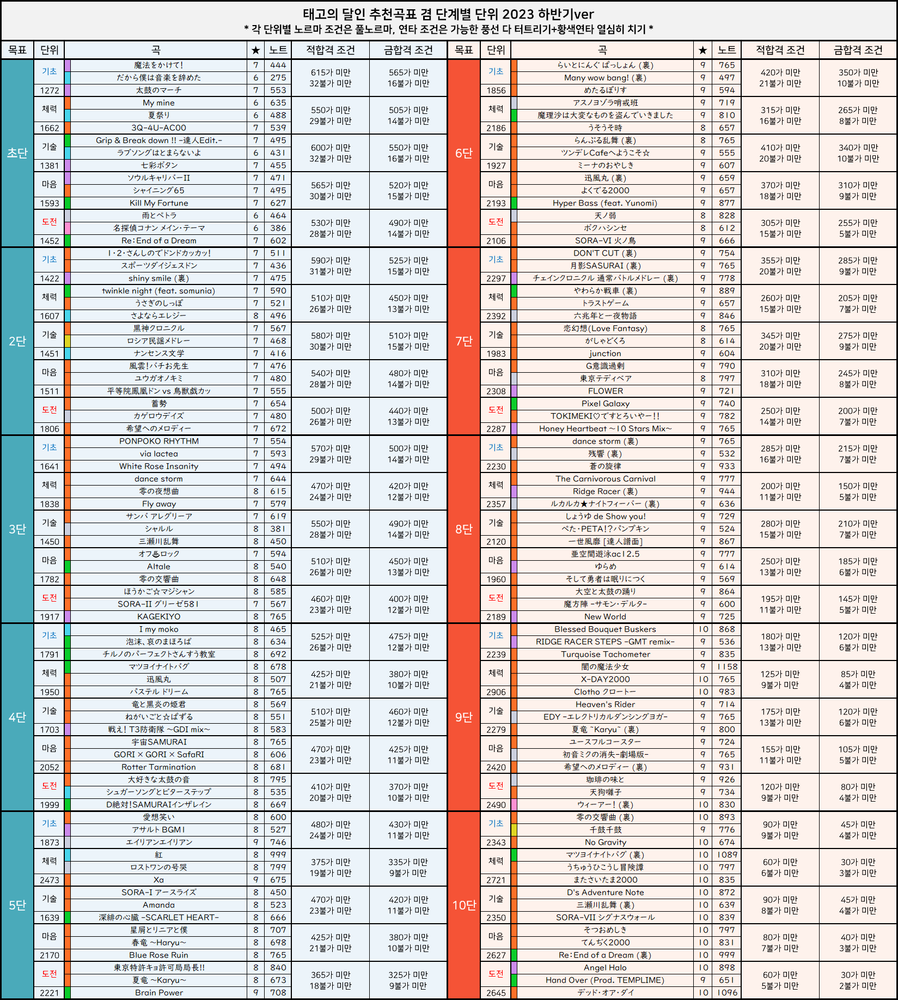

# 목차

목차는 나무로 만든 Tea입니다.

# 단위
---
예시


---
## 데이터
- 수록 버전
- 단위 종류
- ?이름
- 곡
    - songNo
    - 난이도
- 조건
    - 적합격
        - 개별 조건 여부
        - 조건 종류
        - 기준치 (배열/수)
    - 금합격

```ts
interface DaniSong{
    songNo: string;
    difficulty: "easy" | "normal" | "hard" | "oni" | "ura";
}

type DaniConditionType = "gauge" | "combo" | "score" | "roll" | "hit" | "good" | "ok" | "bad"

interface GroupDaniCondition{
    isIndividualCondition: false;
    type: DaniConditionType;
    criteria: number[];
}

interface IndividulDaniCondition{
    isIndividualCondition: true;
    type: DaniConditionType;
    criteria: number;
}

type DaniCondition = GroupDaniCondition | IndividualDaniCondition;

interface DaniBase{
    version: "katsudon" | "sorairo" | "momoiro" | "kimidori" | "murasaki" | "white" | "red" | "yellow" | "blue" | "green" | "20" | "21" | "22" | "23" | "24"; //추후에 추가될 지도?
    songs: DaniSong[];
    conditions: {
        red: DaniCondition[];
        gold: DaniCondition[];
    }
}

interface RegularDani extends DaniBase{
    dan: "senpo" | "jiho" | "chiuken" | "fukusho" | "taisho" | "beginner" | "10kyu" | "9kyu" | "8kyu" | "7kyu" | "6kyu" | "5kyu" | "4kyu" | "3kyu" | "2kyu" | "1kyu" | "1dan" | "2dan" | "3dan" | "4dan" | "5dan" | "6dan" | "7dan" | "8dan" | "9dan" | "10dan" | "kuroto" | "meijin" | "chojin" | "tatsujin";
    name: null;
}

interface GaidenDani extends DaniBase{
    dan: "gaiden";
    name: string;
}

type Dani = RegularDani | GaidenDani;
```

